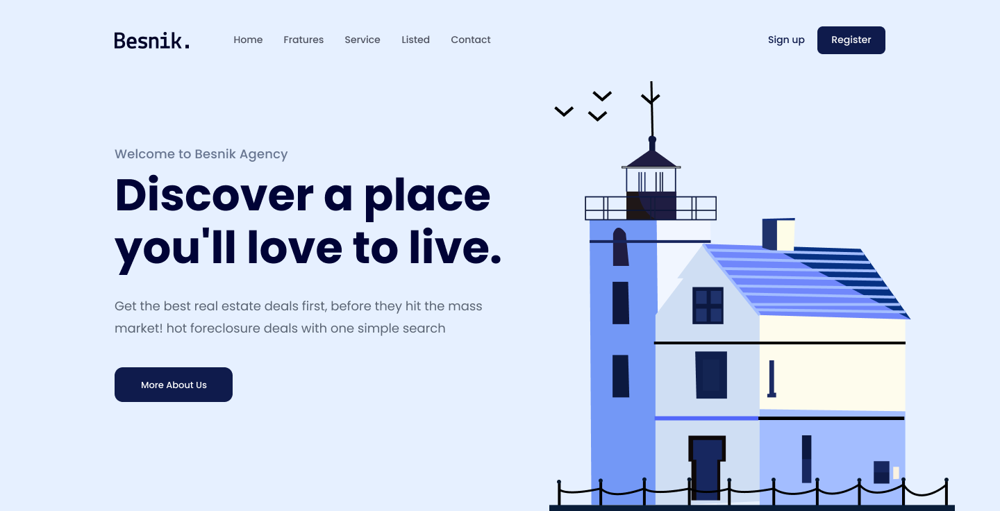

# Project 01 - Khoá học HTML CSS PRO

## Nội dung
- Đây là project thực hành đầu tiên trong khoá học.
- Nội dung của project là thực hiện code giao diện theo một file figma có sẵn với code html, css thuần.

## Tài nguyên
- [Figma](https://www.figma.com/design/Zs7vjnMWc3jj09J94gr57L/01.-Real-Estate-Landing-Page--Easy---1-?node-id=25-2&p=f&t=Wr9w5fSEizMjXnOX-0)